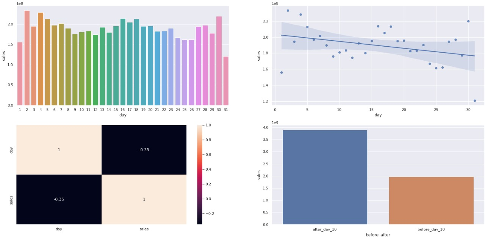

# Rossman Drugstore Sales Prediction

# Introdução 
Esse é um projeto end-to-end de Data Science com modelo de regressão adaptada para séries temporais. No qual criamos 4 tipos de modelos para predizer o valor das vendas das lojas nas próximas 6 semanas. As previsões podem ser acessadas pelo usuário por meio de um BOT no aplicativo do Telegram.

Este repositório contém a solução para a resolução de uma problema do Kaggle: https://www.kaggle.com/c/rossmann-store-sales 

Esse projeto faz parte da "Comunidade DS", que é um ambiente de estudo que promove o aprendizado, execução, e discussão de projetos de Data Science.

### Plano de Desenvolvimento do Projeto de Data Science
Esse projeto foi desenvolvido seguindo o método CRISP-DS(Cross-Industry Standard Process - Data Science). Essa é uma metodologia capaz de transformar os dados da empresa em conhecimento e informações que auxiliam na tomada de decisão. A metodologia CRISP-DM define o ciclo de vida do projeto, dividindo-as nas seguintes etapas:
* Entendimento do Problema de Negócio 
* Coleção dos Dados
* Limpeza de Dados
* Análise Exploratória dos Dados
* Preparação dos Dados
* Modelos de Machine Learning e Fine-Tuning.
* Avaliação dos Resultados do Modelo e Tradução para Negócio.
* Modelo em Produção

### Planejamento
* [1. Descrição e Problema de Negócio](#1-descrição-e-problema-de-negócio)
* [2. Base de Dados e Premissas de Negócio](#2-base-de-dados-e-premissas-de-negócio)
* [3. Estratégia de Solução](#3-estratégia-de-solução)
* [4. Exploration Data Analysis](#4-exploration-data-analysis)
* [5. Seleção do Modelo de Machine Learning](#5-seleção-do-modelo-de-machine-learning)
* [6. Performance do Modelo](#6-performance-do-modelo)
* [7. Resultados de Negócio](#7-resultados-de-negócio)
* [8. Modelo em Produção](#8-modelo-em-produção)
* [9. Conclusão](#9-conclusão)
* [10. Aprendizados e Trabalhos Futuros](#10-aprendizados-e-trabalhos-futuros)

# 1. Descrição e Problema de Negócio

### 1.1 Descrição
**Rossman Sales Drugstore** é uma empresa que opera mais de 3000 drogarias em 7 países europeus. Atualmente os gerentes da loja Rossman têm a tarefa de prever suas vendas diárias com até seis semanas de antecedência. As vendas das lojas são influenciadas por muitos fatores, incluindo promoções, competição, feriados escolares e estaduais, sazonalidade e localidade. Atualmente essa previsão é feita por meio de uma simples média das vendas de cada loja. 

### 1.2 Problema de Negócio
Foi feita uma reunião entre o CEO e os sócios da Rossman e foi definido que a empresa irá investir nas reformas das lojas da rede Rossman. Para que essa reforma seja possível será necessário prever o valor de vendas de cada loja de maneira mais assertiva, para que assim o CEO tenha uma melhor noção do quanto investir em cada loja. 

Dito isso,a empresa decidiu contratar um Cientista de Dados para realizar as seguintes tarefas:

**- Realizar a previsão das vendas de cada uma das lojas nas pŕoxima seis semanas.**

**- Fornecer ao CEO uma forma de consulta rápida dessas previsões por meio do celular.**

# 2. Base de Dados e Premissas de Negócio
## 2.1 Base de Dados
O conjunto de dados total possui as informações referentes 1115 lojas e possuem os seguintes atributos:
* Id - um identificador que representa uma dupla (Store, Date) dentro do conjunto de teste.
* Store - identificador único de cada loja
* Sales - O valor das vendas dado o dia.
* Customers - número de clientes dado o dia.
* Open - indicador que informa se a loja está aberta: 0 = fechado, 1 = aberta.
* StateHoliday - Indica um feriado estadual. Geralmente todas lojas, com algumas exceções, fecham em feŕiados estaduais. Note que todas escolas estão fechadas nos feriados e finais de semana. a = Feriado  b = Feriado da Páscoa , c = Feriado de Natal Christmas, 0 = Nenhum
* SchoolHoliday - indica se (Store, Date) foi afetada pelo fechamento de escolas públicas.
* StoreType - Diferencia 4 tipos diferentes de loja: a, b, c, d
* Assortment - Descreve o tipo de nível de estoque: a = básico, b = extra, c = extended
* CompetitionDistance - distância em metros do competidor mais próximo.
* CompetitionOpenSince[Month/Year] - É o ano e mês em que o concorrente mais próximo foi aberto.
* Promo - indica se a loja está com alguma promoção em vigẽncia naquele dia.
* Promo2 - Promo2 é uma promocação contínua e consecutiva para algumas lojas: 0 = loja não está participando, 1 = a loja está participando.
* Promo2Since[Year/Week] - descreve o ano e a semana em que a loja começou a participar da Promo2.
* PromoInterval - descreve os intervalos consecutivos do início da promo2, nomeando os mês que a promoção é iniciada novamente. Ex:("fev,maio,agosto") significa que cada rodada começa em fav, maio, agosto para qualquer ano dado daquela loja.
## 2.2 Premissas de Negócio
Para realizar esse projeto as seguintes premissas de negócio foram adotadas:
* Os dados de costumers foram descartados, visto que para utilizar esse atributo teríamos que calcular uma previsão de número de clientes que pode-se tornar um projeto a parte complementar a este.
* Os dias que as lojas encontram-se fechadas foram descartadas.
* Só foram consideradas as entradas que obtiveram o valor de venda ("SALES") maior que 0.
* Para lojas que não tinham informação de Competition Distance foi adotado um valor arbitrário alto para efeitos de comparação.
# 3. Estratégia de Solução
A estratégia de solução foi a seguinte:
### Passo 01. Descrição dos Dados
Nesse passo foi verificado alguns aspectos do conjunto de dados, como: nome de colunas, dimensões, tipos de dados, checagem e preenchimento de dados faltantes (NA), análise descritiva dos dados e quais suas variáveis categóricas.
### Passo 02. Featuring Engineering
Na featuring engineering foi derivado novos atributos(colunas) baseados nas variáveis originais, possibilitando uma melhor descrição do fenômeno daquela variável.

### Passo 03. Filtragem de Variáveis
O conjunto de dados foi filtrado por linhas para que levássemos em consideração apenas as lojas que estão abertas e que realizaram vendas ( open != 0 e sales > 0) e por coluna foi feita um drop das variáveis que não agregam valor de conhecimento ou foram derivados para outras variáveis.
### Passo 04. Análise Exploratória dos Dados (EDA)
Exploração dos Dados com objetivo de encontrar Insights para o melhor entendimento do Negócio. 
Foram feitas também análises univariadas, bivariadas e multivariadas, obtendo algumas propriedades estatísticas que as descrevem, e mais importante  a correlação entre as variáveis.
### Passo 05. Preparação dos Dados
Sessão que trata da preparação dos dados para que os algoritmos de Machine Learning possam ser aplicados. Foram realizados alguns tipos de escala e encoding para que as variáveis categóricas se tornassem numéricas.
### Passo 06. Seleção de Variáveis do Algoritmo
A seleção dos atributos foi realizada utilizando o método de seleção de variáveis Boruta. No qual os atributos mais significativos foram selecionados para que a performance do modelo fosse maximizada.
### Passo 07. Modelo de Machine Learning
Realização do treinamento dos modelos de Machine Learning . O modelo que apresentou a melhor perfomance diante a base de dados com cross-validation aplicada seguiu adiante para a hiper parametrização das variáveis daquele modelo, visando otimizar a generalização do modelo.
### Passo 08. Hyper Parameter Fine Tuning
Foi encontrado os melhores parâmetros que maximizavam o aprendizado do modelo. Esses parâmetros foram definidos com base no método de RandomSearch.
### Passo 09. Conversão do Desempenho do Modelo em Valor de Negócio
Nesse passo o desempenho do modelo foi analisado mediante uma perspectiva de negócio,e traduzido para valores de negócio.
### Passo 10. Deploy do Modelo em Produção 
Publicação do modelo em um ambiente de produção em nuvem (Heroku) para que fosse possível o acesso de pessoas ou serviços para consulta dos resultados e com isso melhorar a decisão de negócio da empresa.

### Passo 11. Telegram Bot
Criação de um bot no Aplicativo de mensagens do Telegram. Cuja consulta das previsões podem ser feitas de qualquer lugar a qualquer momento apenas utilizando uma conexão com a internet e o aplicativo no smartphone.

# 4. Exploration Data Analysis 
## 4.1 Análise Univariada
* Variáveis Numéricas: o histograma abaixo mostra como está organizada a distribuição das variáveis numéricas do nosso conjunto de dados.

## 4.2 Análise Bivariada
### H2. Lojas com competidores mais próximos deveriam vender menos.
**FALSO**, lojas com competidores mais próximos vendem mais.
* No 1º gráfico podemos ver que a maioria dos dados estão concentrados num range de distância de 0 a 25000. 
* No 2º gráfico foi feito um agrupamento por intervalos de distância, como observado as lojas que tem competidores mais próximos tem mais vendas.
* O heatmap demonstra uma correlação negativa, isso significa que a variável é relevante mas não muito. 
 

### H3. Lojas com competidores à mais tempo deveriam vender mais.
**FALSO**, lojas com competidores à mais tempo vendem menos. 
* A variável "competition_time_month" foi criada e indica há quanto tempo em meses aquela loja enfreta uma competição. PS: valores negativos significam que o competidor ainda não iniciou as vendas.
* Podemos ver que as lojas que têm competidores há mais tempo vendem menos.

### H9. Lojas deveriam vender mais no segundo semestre do ano
**FALSO**, lojas vendem mais no 1º semestre do ano.
* Como podemos ver, durante os 6 primeiros meses as lojas vendem mais do que o resto do ano.
* Correlação muito forte negativamente, essa é considerada uma das variáveis mais importantes para o modelo. 

### H10. Lojas deveriam vender mais depois do dia 10 de cada mês
**VERDADEIRO**, lojas vendem mais após dia 10 de todo mês.
* Nessa hipótese a ideia era verificar se as vendas no início do mês, no qual geralmente é feito o pagamento de salário, conseguiria alcançar as vendas nos 20 dias restantes do mês.
* Lojas vendem menos no período inicial de 10 dias de cada mês.
* Correlação Negativa.

### H11. Lojas deveriam vender menos aos finais de semana
**VERDADEIRO**, lojas vendem mais durante os dias regulares da semana.
* Correlação forte negativamente. Isso significa que se as lojas se encontrarem no período de final de semana, irão vender menos.

### Tabela de Insights 

| Hipóteses | Condição| Relevância |
| :-------- | :------- | :--------  |
|H1. Lojas com maior sortimento deveriam vender mais|Falsa|Baixa|
|H2. Lojas com competidores mais próximos deveriam vender menos.|Falsa|Média|
|H3. Lojas com competidores à mais tempo deveriam vender mais.|Falsa|Média|
|H4. Lojas com promoções mais ativas por mais tempo deveriam vender mais.|Falsa|Baixa|
|H5. Lojas com mais dias de promoção deveriam vender mais.| --- |---|
|H6. Lojas com mais promoções consecutivas deveriam vender mais.|Falsa|Baixa|
|H7. Lojas abertas durante o feriado de Natal deveriam vender mais|Falsa|Média|
|H8. Lojas deveriam vender mais ao longo dos anos.|Falsa|Alta|
|H9. Lojas deveriam vender mais no segundo semestre do ano.|Falsa|Alta|
|H10 .Lojas deveriam vender mais depois do dia 10 de cada mês.|Verdadeira|Alta|
|H11 .Lojas deveriam vender menos aos finais de semana.|Verdadeira|Alta|
|H12 .Lojas deveriam vender menos durante os feriados escolares.|Verdadeira|Baixa|

## 4.3 Análise Multivariada

 
 ### Correlação entre as variáveis independentes e a variável resposta
 * Variáveis com correlação positiva com as vendas:
   * **Forte:** > *customers, open*
   * **Média:** > *promo*
   * **Fraca:** > *competition_open_since_year, promo2_since_year*

* Variáveis com correlação negativa com as vendas:
  * **Forte:** -
  * **Média:** > *day_of_week*
  * **Fraca:** > *promo2, is_promo*

# 5. Seleção do Modelo de Machine Learning 
Os seguintes algoritmos de Machine Learning foram aplicados:
* Mean Average Model (Nosso baseline);
* Linear Regression Model;
* Linear Regression Regularized Model - Lasso;
* Random Forest Regression;
* XGBoost Forest Regression;

O método de cross-validation foi utilizado em todos os modelos.

# 6. Performance do Modelo
O modelo RandomForestRegressor foi o modelo que apresentou o melhor desempenho em Single Performance, com um percentual de Erro médio (MAPE) de aproximadamente 10%. No entanto nesse projeto foi optado a utilização do modelo **XGBoost Regressor** visto que a performance do modelo é equivalente a RandomForest, e ele lida melhor com base de dados maiores e tende a ser mais rápido em sua etapa de treinamento do modelo.

|Model Name	| MAE	| MAPE	| RMSE|
|---------|----|----|----|
|Random Forest Regressor	|679.098387	|0.099882	| 1009.869873
|**XGBoost Regressor**	|**711.319910**	|**0.103848**| **1026.422526**|
|Average Model	|1354.800353	|0.206400	|1835.135542|
|Linear Regression	|1867.089774|	0.292694|	2671.049215|
|Linear Regression Regularized - Lasso	|1891.704880	|0.289106	|2744.451735|

A real performance dos modelos utilizando método CROSS-VALIDATION.

|Model Name	|MAE CV	|MAPE CV	|RMSE CV|
|----------| -------|---------|--------|
|Random Forest Regression	|837.47 +/- 218.61	|0.12 +/- 0.02	|1257.22 +/- 319.82|
|**XGBoost Regressor**|**923.71 +/- 150.9**	|**0.13 +/- 0.01**	|**1323.78 +/- 214.82**|
|Linear Regression	|2081.73 +/- 295.63	|0.3 +/- 0.02	|2952.52 +/- 468.37|
|Linear Regression Regularized	|2116.38 +/- 341.5	|0.29 +/- 0.01	|3057.75 +/- 504.26|

Escolhido o modelo de Regressão XGBoost partimos para a etapa de HyperParamater Fine-Tuning que consiste em encontrar os melhores parâmetros de treino para maximizar o aprendizado do modelo. Após encontrarmos os valores ótimos para o modelo por meio do método RandomSearch os valores finais de desempenho do modelo foram:

## Final-Performance Fine-Tuned CV Model
|Model Name | MAE CV | MAPE CV | RMSE CV |
|-----|----|----|-----
|XGBoost Regressor | CV	887.49 +/- 148.25	|0.13 +/- 0.02	|1253.53 +/- 203.62

# 7. Resultados de Negócio
Com base no método atual de previsão de vendas é possível analisarmos a diferença de performance entre o modelo utilizado ( Average Model) e o modelo proposto XGBoost Regressor.

**Modelo Atual baseado na média de vendas**

|Cenário| Valores|
|---|---|
| Predições | R$280.754.389,45| 

**Modelo XGBoost sugerido**
|Cenário|Valores|
|------|------|
|Predições|	R$286.772.224,00|
|Pior Cenário|	R$286.025.344,34|
|Melhor Cenário|	R$287.519.068,14|

**Diferença entre os Modelos**
|Cenário|Valores|
|------|------|
|Pior Cenário|R$5.270.954,89|
|Melhor Cenário|R$6.764.678,69|

O modelo XGboost teve um bom desempenho para as lojas Rossman, porém tivemos algumas lojas as quais o MAPE ficou muito acima do normal, como podemos ver nas tabelas e gráficos abaixo:

|store|  predictions |worst_scenario|  best_scenario|   MAE| MAPE|
|-----|--------------|--------------|-------------|-------|------|
|292 |104717.539062|   101427.253881 |  108007.824244 |  3290.285182| **0.558823**
|909 |237762.593750|   230099.762844 |  245425.424656 |  7662.830906| **0.524063**
|876 |212583.593750|   208622.899499 |  216544.288001 |  3960.694251| **0.322960**
|595 |379311.031250|   375259.626940 |  383362.435560 |  4051.404310| **0.280480**
|722 |351640.437500|   349685.182168 |  353595.692832 |  1955.255332| **0.261245**
|841 |118983.031250|   118276.835387 |  119689.227113 |  706.195863 | 0.257374
|274 |194824.750000|   193459.754775 |  196189.745225 |  1364.995225| 0.234964

* Nesse gráfico, podemos observar a distribuição dos erros MAPE para todas as lojas da rede Rossman. É importante notar que existem algumas lojas em específico que são mais desafiadoras que outras na previsão das vendas. Porém, é razoável assumir que nosso modelo desempenhou bem de maneira geral visto que a maioria das nossas lojas está concentrada em uma área com um MAPE próximo a 10%. É claro que, o CEO e a equipe de negócio devem analisar esses dados e definir se é "aceitável" esse valor de erro ou não. 

* Alguns outros gráficos foram plotados com objetivo de fornecer um maior entendimento ao time de negócio como o nosso modelo se comporta de maneira geral. O 1º gráfico nos mostra os valores de vendas (linhas azuis) e a predição do modelo (linhas laranjas) das últimas 6 semanas de venda. Como podemos ver, nosso modelo se comporta muito bem, acompanhando de perto as vendas reais.

* No 2º gráfico é representado a taxa de erros com relação às vendas. Essa taxa é calculada pela razão entre os valores preditos e os valores reais de venda observados. Visto que o modelo não possui taxas muito exorbitantes, podemos assumir que ele teve um bom desempenho.

* No 3º gráfico podemos ver a distribuição da taxa de erro, que tem como característica uma forma normal cujo centro está tendendo a 0.

* O 4º gráfico demonstra a dispersão que representa as previsões realizadas em relação aos erros de cada dia de venda. Idealmente, nós teríamos nossos pontos concentrados e formaríamos uma espécie de "tubo", pois dessa forma ela representaria uma baixa variação de erro em todos valores que a previsão de vendas poderia assumir.

# 8. Modelo em Produção
O modelo de Machine Learning foi implementado e colocado em produção por meio da plataforma Heroku, que tem como objetivo possibilitar a criação, execução e operação de aplicativos inteiramente localizados em nuvem. 
Além do modelo em si presente na nuvem, foi criado um BOT no aplicativo do Telegram que possibilita ao CEO e os time de negócio da empresa realizarem consultas da previsão de vendas das lojas nas próximas 6 semanas de forma simples e direta. Basta apenas utilizar um smartphone e enviar uma mensagem ao bot no Telegram localizado no endereço: https://t.me/rossman_jordanm_bot.

Forma de Utilização:
* Criar conta no Telegram em seu smartphone e abrir o link citado acima.
* Enviar o caractere "/" junto ao número de loja que deseja saber a previsão de venda.

# 9. Conclusão
Nesse projeto, foram realizadas todas as etapas necessárias para a implementação de um projeto completo de Data Science em um ambiente de produção. Foi utilizado o método de gerenciamento de projeto chamado CRISP-DM/DS e obteve-se um desempenho satisfatório utilizando o modelo de Regressão XGBoost para realizar a previsão de venda das lojas da rede Rossman para as próximas 6 semanas.

Vários Insights de Negócio foram gerados durante a Análise Exploratória de dados que ajudaram o CEO, junto ao time de negócio e o cientista de dados a entenderem melhor o negócio. Tendo em vista esses resultados, o projeto alcançou seu objetivo de encontrar uma solução simples e assertiva para previsão de vendas das lojas, disponibilizando um BOT no Telegram que retorna as previsões geradas pelo modelo de forma rápida e eficaz.

# 10. Aprendizados e Trabalhos Futuros

**Aprendizados**

* Esse problema de predição foi resolvido utilizando técnicas de Regressão adaptadas a Time-Series.

* A escolha do modelo de Machine Leaning deve-se levar em consideração não só a performance do modelo em si, mas também sua generabilidade, levando em consideração o custo de implementação, a dificuldade e tempo de execução de todo projeto.

* A Análise Exploratória de Dados se demonstrou uma das etapas mais importantes do projeto, pois é nessa parte que podemos encontrar Insights de Negócio que promovem novos conhecimentos e até contradições que nos fazem repensar o negócio como um tudo. Essa análise também fornece ao cientista de dados uma "direção" de como melhorar seu modelo, por meio da criação de novas features e diferentes tipos de abordagem.

**Trabalhos Futuros**
* Entender melhor as lojas com taxas de erros muito elevadas.
* Criar novas features a partir de variáveis com correlação forte com a variável resposta.
* Criar um modelo específico para analisarmos o número de clientes de cada loja.
* Tentar métodos de Encoding diferentes para melhor performance do modelo.

